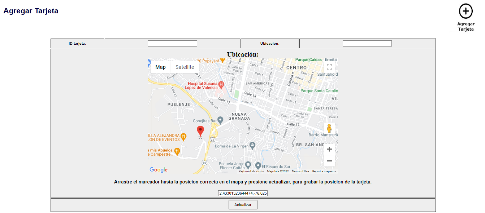
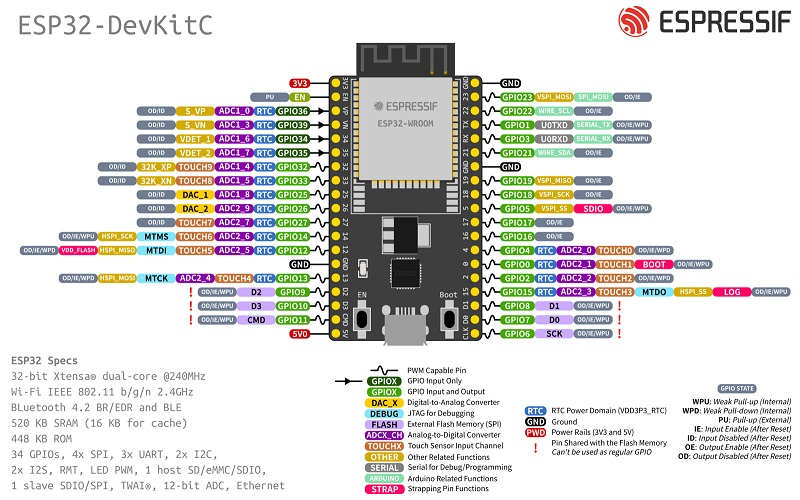
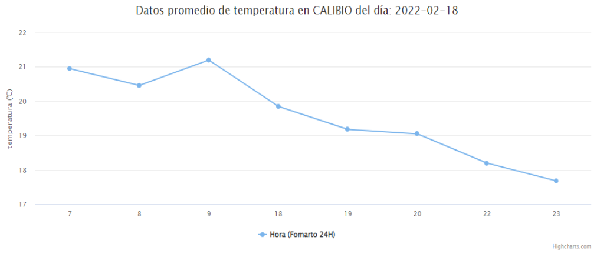

<!-- Improved compatibility of back to top link: See: https://github.com/othneildrew/Best-README-Template/pull/73 -->
<a name="readme-top"></a>
<!--
*** Thanks for checking out the Best-README-Template. If you have a suggestion
*** that would make this better, please fork the repo and create a pull request
*** or simply open an issue with the tag "enhancement".
*** Don't forget to give the project a star!
*** Thanks again! Now go create something AMAZING! :D
-->

<!-- PROJECT LOGO -->
<br />
<div align="center">
  <a href="https://github.com/AndresDiagoM/ClimasPopayan">
    <!--  -->
  </a>

  <h3 align="center">ClimasPopayan</h3>

  <p align="center">
    IoT project
    <br />
    <a href="https://github.com/AndresDiagoM/ClimasPopayan/tree/main/docs"><strong>Explore the docs »</strong></a>
    <br />
    <br />
    <a href="https://github.com/AndresDiagoM/ClimasPopayan">View Demo</a>
    ·
    <a href="https://github.com/AndresDiagoM/ClimasPopayan/issues">Report Bug</a>
    ·
    <a href="https://github.com/AndresDiagoM/ClimasPopayan/issues">Request Feature</a>
  </p>
</div>

<!-- PROJECT SHIELDS -->
<!--
*** I'm using markdown "reference style" links for readability.
*** Reference links are enclosed in brackets [ ] instead of parentheses ( ).
*** See the bottom of this document for the declaration of the reference variables
*** for contributors-url, forks-url, etc. This is an optional, concise syntax you may use.
*** https://www.markdownguide.org/basic-syntax/#reference-style-links
-->
[![Contributors][contributors-shield]][contributors-url]
[![Forks][forks-shield]][forks-url]
[![Stargazers][stars-shield]][stars-url]
[![Issues][issues-shield]][issues-url]
[![MIT License][license-shield]][license-url]
[![LinkedIn][linkedin-shield]][linkedin-url]


<!-- TABLE OF CONTENTS -->
<details>
  <summary>Table of Contents</summary>
  <ol>
    <li>
      <a href="#about-the-project">About The Project</a>
      <ul>
        <li><a href="#built-with">Built With</a></li>
      </ul>
    </li>
    <li>
      <a href="#getting-started">Getting Started</a>
      <ul>
        <li><a href="#prerequisites">Prerequisites</a></li>
        <li><a href="#installation">Installation</a></li>
      </ul>
    </li>
    <li><a href="#usage">Usage</a></li>
    <li><a href="#contributing">Contributing</a></li>
    <li><a href="#license">License</a></li>
    <li><a href="#contact">Contact</a></li>
    <li><a href="#acknowledgments">Acknowledgments</a></li>
  </ol>
</details>


<!-- ABOUT THE PROJECT -->
## About The Project

[![Product Name Screen Shot][product-screenshot]](https://example.com)

IoT project, where weather conditions are measured, using an ESP32 card and the necessary sensors. These data are sent to a web page, where there are graphs and analysis of the data.

The MySQL database can be created by importing the 'u483173002_practica1b.sql' file.

The .ino program for the ESP32 card is 'sensorV2.ino'.




REQUEST:
A System is required that allows citizens to access (through the Internet) the information of the climate measurement, from different points of the city.
The measurement devices must be able to be registered in the system by an administrator user, indicating the location on a map. Each device (the system must have at least 3 in different parts of the city) must have the necessary sensors to make the required measurements (temperature, humidity, rain, location).
The query user and administrator must have access to current and historical information. The administrator user will have privileged information about the data measured by the system.

The measurement devices must be able to be registered in the system by an administrator user, indicating the location on a map.

<p align="right">(<a href="#readme-top">back to top</a>)</p>


### Built With

The project was developed with the following technologies:

<div align="center">

 [![PHP][PHP.com]][PHP-url]
 [![Arduino][Arduino.com]][Arduino-url]
 [![Laravel][Laravel.com]][Laravel-url]
 [![JQuery][JQuery.com]][JQuery-url]
</div>

For the hardware part, the following components were used:

* [ESP32](https://www.espressif.com/en/products/socs/esp32)
  


* [DHT11](https://www.mouser.com/datasheet/2/758/DHT11-Technical-Data-Sheet-Translated-Version-1143054.pdf)
* [GPS-neo-6m](https://www.u-blox.com/sites/default/files/products/documents/NEO-6_DataSheet_%28GPS.G6-HW-09005%29.pdf)
* [LCD-oled-arduino](https://www.arduino.cc/en/uploads/Guide/SSD1306.pdf)


<p align="right">(<a href="#readme-top">back to top</a>)</p>


<!-- GETTING STARTED -->
## Getting Started

To get a local copy up and running follow these simple steps. You can also download the .zip file.

1. Clone the repo
   ```sh
   git clone https://github.com/AndresDiagoM/ClimasPopayan
    ```


### Prerequisites

Configure the environment with xampp and arduino IDE.

1. Install Arduino IDE
   ```sh
   https://www.arduino.cc/en/software
   ```
2. Install xampp
   ```sh
   https://www.apachefriends.org/es/index.html
   ```
3. Configure the database
   ```sh
   Import the database from the file 'u483173002_practica1b.sql'
   ```
4. Configure the .ino file
   ```sh
    Modify the variables 'ssid' and 'password' with the name and password of your wifi network.
    Modify the variable 'host' with the IP of your server.
    ```
5. Upload the .ino file to the ESP32 card


<!-- USAGE EXAMPLES -->
## Usage

The web page has a login system, where the administrator can register new devices and view the data of each device.

The user can view the data of each device, in addition to the historical data.




_For more examples, please refer to the [Documentation](https://github.com/AndresDiagoM/ClimasPopayan/tree/main/docs)_

<p align="right">(<a href="#readme-top">back to top</a>)</p>


<!-- CONTRIBUTING -->
## Contributing

Contributions are what make the open source community such an amazing place to learn, inspire, and create. Any contributions you make are **greatly appreciated**.

If you have a suggestion that would make this better, please fork the repo and create a pull request. You can also simply open an issue with the tag "enhancement".
Don't forget to give the project a star! Thanks again!

1. Fork the Project
2. Create your Feature Branch (`git checkout -b feature/AmazingFeature`)
3. Commit your Changes (`git commit -m 'Add some AmazingFeature'`)
4. Push to the Branch (`git push origin feature/AmazingFeature`)
5. Open a Pull Request

<p align="right">(<a href="#readme-top">back to top</a>)</p>


<!-- LICENSE -->
## License

Distributed under the MIT License. See `LICENSE.txt` for more information.

<p align="right">(<a href="#readme-top">back to top</a>)</p>


<!-- CONTACT -->
## Contact

Project Link: [https://github.com/AndresDiagoM/ClimasPopayan](https://github.com/AndresDiagoM/ClimasPopayan)

<p align="right">(<a href="#readme-top">back to top</a>)</p>


<!-- ACKNOWLEDGMENTS -->
## Acknowledgments

Use this space to list resources you find helpful and would like to give credit to. I've included a few of my favorites to kick things off!

* [Choose an Open Source License](https://choosealicense.com)
* [GitHub Emoji Cheat Sheet](https://www.webpagefx.com/tools/emoji-cheat-sheet)
* [Malven's Flexbox Cheatsheet](https://flexbox.malven.co/)
* [Malven's Grid Cheatsheet](https://grid.malven.co/)
* [Img Shields](https://shields.io)
* [GitHub Pages](https://pages.github.com)
* [Font Awesome](https://fontawesome.com)
* [React Icons](https://react-icons.github.io/react-icons/search)

<p align="right">(<a href="#readme-top">back to top</a>)</p>


<!-- MARKDOWN LINKS & IMAGES -->
<!-- https://www.markdownguide.org/basic-syntax/#reference-style-links -->
[contributors-shield]: https://img.shields.io/github/contributors/othneildrew/Best-README-Template.svg?style=for-the-badge
[contributors-url]: https://github.com/AndresDiagoM/ClimasPopayan/graphs/contributors
[forks-shield]: https://img.shields.io/github/forks/othneildrew/Best-README-Template.svg?style=for-the-badge
[forks-url]: https://github.com/AndresDiagoM/ClimasPopayan/network/members
[stars-shield]: https://img.shields.io/github/stars/othneildrew/Best-README-Template.svg?style=for-the-badge
[stars-url]: https://github.com/AndresDiagoM/ClimasPopayan/stargazers
[issues-shield]: https://img.shields.io/github/issues/othneildrew/Best-README-Template.svg?style=for-the-badge
[issues-url]: https://github.com/AndresDiagoM/ClimasPopayan/issues
[license-shield]: https://img.shields.io/github/license/othneildrew/Best-README-Template.svg?style=for-the-badge
[license-url]: https://github.com/AndresDiagoM/ClimasPopayan/blob/master/LICENSE.txt
[linkedin-shield]: https://img.shields.io/badge/-LinkedIn-black.svg?style=for-the-badge&logo=linkedin&colorB=555
[linkedin-url]: https://www.linkedin.com/in/andres-felipe-diago-matta/
[product-screenshot]: img/clima-tipos.jpg


[Laravel.com]: https://img.shields.io/badge/Laravel-FF2D20?style=for-the-badge&logo=laravel&logoColor=white
[Laravel-url]: https://laravel.com

[JQuery.com]: https://img.shields.io/badge/jQuery-0769AD?style=for-the-badge&logo=jquery&logoColor=white
[JQuery-url]: https://jquery.com 
[Arduino.com]: https://img.shields.io/badge/Arduino-00979D?style=for-the-badge&logo=arduino&logoColor=white
[Arduino-url]: https://www.arduino.cc/
[PHP.com]: https://img.shields.io/badge/PHP-777BB4?style=for-the-badge&logo=php&logoColor=white
[PHP-url]: https://www.php.net/